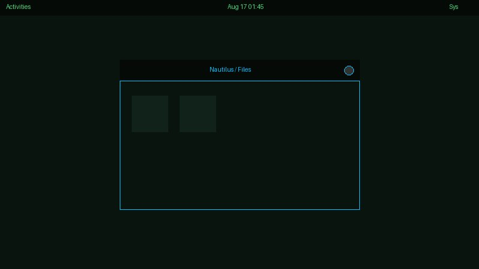
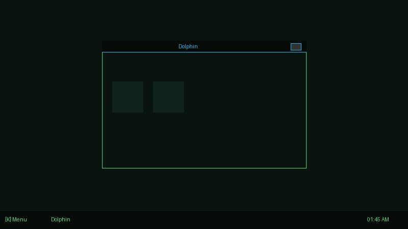

# Halo Cortana - Universal Desktop Theme Pack

Tema desktop bernuansa sci-fi gelap yang terinspirasi dari antarmuka UNSC, Master Chief (Armor Green), dan AI Cortana (Holo Blue). Tema ini dikonfigurasi untuk bekerja dengan dua ekosistem Desktop Linux terbesar (GNOME dan KDE Plasma 6) sekaligus!

## Preview (Pratinjau)

### GNOME (GTK4 / Libadwaita & GNOME Shell)


### KDE Plasma 6 (Aurorae & Kvantum)


---

## Fitur & Dukungan
*   **GTK 3 & GTK 4 (Libadwaita)**: Mengubah warna jendela dan tombol lewat konfigurasi CSS. (Force Dark-Mode included).
*   **GNOME Shell**: Kustomisasi panel atas dan menu popup GNOME.
*   **Ikon Otomatis**: Script sudah dikonfigurasi untuk mengaktifkan set ikon `halo-universe`. *(Pastikan Anda sudah menyalin folder ikon halo-universe ke `~/.icons/`)*.
*   **KDE Plasma 6 (Global Theme)**: Meta package untuk integrasi penuh di Plasma 6.
*   **KDE Aurorae**: Dekorasi frame / jendela aplikasi di KDE Plasma.
*   **Kvantum**: Mesin tema Qt berbasis SVG/config untuk transparansi dan styling aplikasi Qt.
*   **Background Integration**: Otomatis menyalin `background.png` ke folder Wallpaper.

## Perbaikan (Bug Fixes) di Versi Ini
1. Memperbaiki *hard-coded bash variable bugs* pada script instalasi.
2. Memastikan konfigurasi GTK4 disalin (overwrite) dengan aman menggunakan flag `-rf`.
3. Menambahkan trigger otomatis GNOME `color-scheme 'prefer-dark'` untuk memaksa aplikasi Libadwaita yang bandel membaca *override* warna.
4. Menambahkan perintah otomatis untuk beralih ke tema ikon `halo-universe`.

## Cara Instalasi
**Penting:** Script ini dipasang pada direktori local pengguna (User Space), sehingga Anda **tidak membutuhkan `sudo` / akses Root**.

1. Ekstrak file zip ini.
2. Buka Terminal di folder hasil ekstraksi.
3. Jalankan script instalasi:
   ```bash
   ./install.sh
   ```

## Konfigurasi Lanjutan Setelah Instalasi
*   **Jika menggunakan GNOME:** Seharusnya sistem akan langsung berubah. Jika GNOME Shell / Top Panel belum berubah, pastikan ekstensi "User Themes" sudah aktif, lalu lakukan **Log Out & Log In**.
*   **Jika menggunakan KDE Plasma 6:** Sistem Plasma memerlukan aktivasi manual setelah tema disalin. Buka **System Settings** -> **Global Theme** dan pilih `Halo-Cortana`. Jangan lupa buka **Kvantum Manager** dan setel `Halo-Cortana` sebagai tema aktif.
